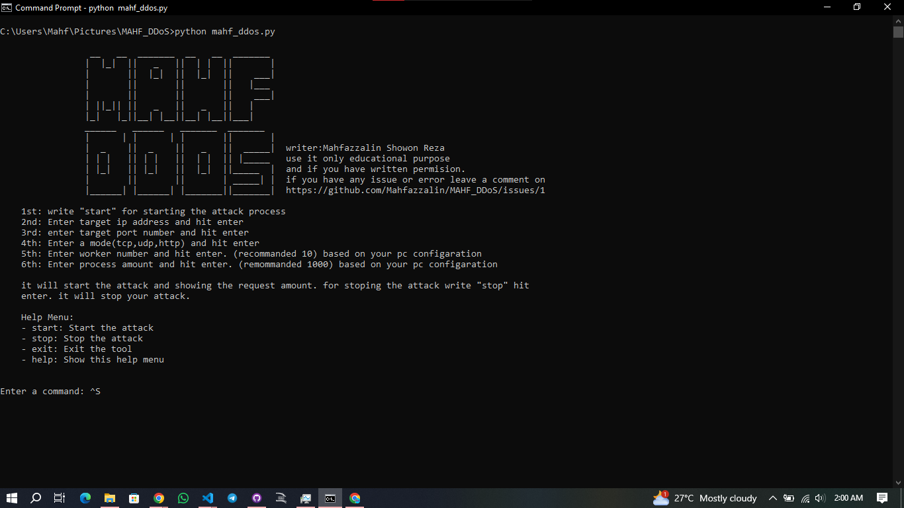

# MAHF_DDoS
 this is perform a flood of tcp,udp,http request. use it only eductional pupose.

This DDoS tool is designed for educational and ethical hacking purposes only. Ensure you have explicit permission from the target before using this tool. Unauthorized use of this tool against networks and servers is illegal and unethical.



## Features

- Support for TCP, UDP, and HTTP flood attacks.
- Real-time monitoring of successful and failed requests.
- Ability to start, stop, and exit the tool using commands.
- Help menu for user guidance.

## easy using:

- 1 Type "start" to begin an attack.
- 2 Enter the target IP address.
- 3 Enter the target port number
- 4 Choose the attack mode (tcp, udp, or http).
- 5 Specify the number of worker threads and processes.
- 6 Type "stop" to stop the attack.
- 7 Type "exit" to exit the tool.
- 8 Type "help" to display the help menu.

## Requirements

- Python 3.x    [version will be 3+]
- Required libraries:
  - `requests` (for HTTP flooding)

You can install the required libraries using pip:

```bash
pip install requests
```

##Installation
- Clone the Repository:
```bash
git clone https://github.com/Mahfazzalin/MAHF_DDoS.git
```
- You can install the required libraries using pip:

```bash
pip install requests
```
```bash
cd MAHF_DDoS
```
- for running the tools
    - for windows and Mac

    ```bash
    python mahf_ddos.py
    ```
    - for Kali or other linux distro
    ```bash
    sudo git clone https://github.com/Mahfazzalin/MAHF_DDoS.git
    ```
    ```bash
    pip install requests
    ```
    ```bash
    cd MAHF_DDoS
    ```
    ```bash
    python3 mahf_ddos.py
    ```


## use nmap for finding a websites ip address and open port.
nmap available on windows , Mac and linux . 
download link
- windows : [click here downloading for windows](https://nmap.org/download#windows)
- linux : [click here downloading for linux](https://nmap.org/download#linux-rpm)
    - or use terminal to install nmap
    ```bash
     sudo apt install nmap #kali linux , use your distro defalt command instead of 'apt' 
     ```
- Mac : [click here downloading for Mac os](https://nmap.org/download#macosx)

## check on  wireshark after perform an attack.
wireshark also available on windows,Mac and linux
- download link: [click here to download](https://www.wireshark.org/download.html)
